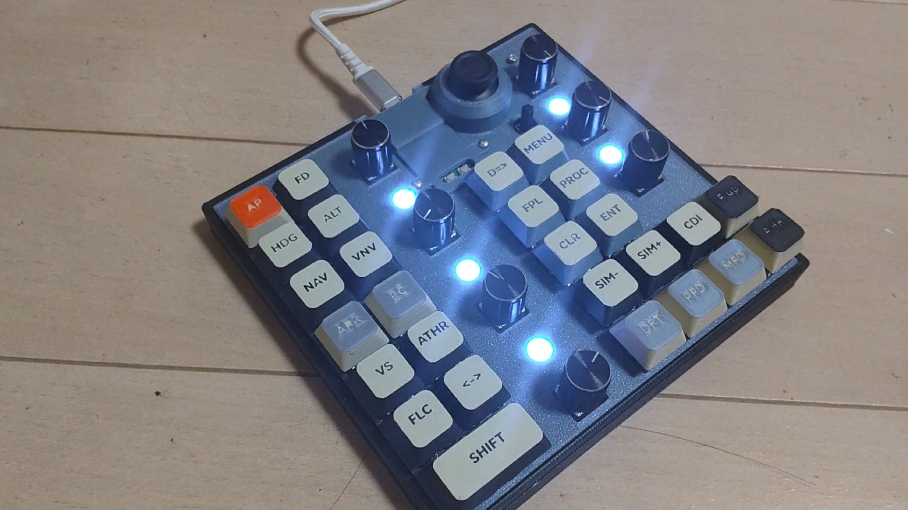
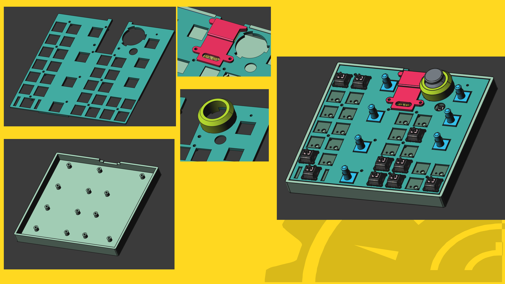
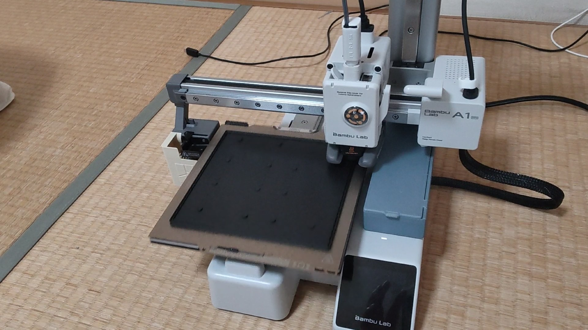
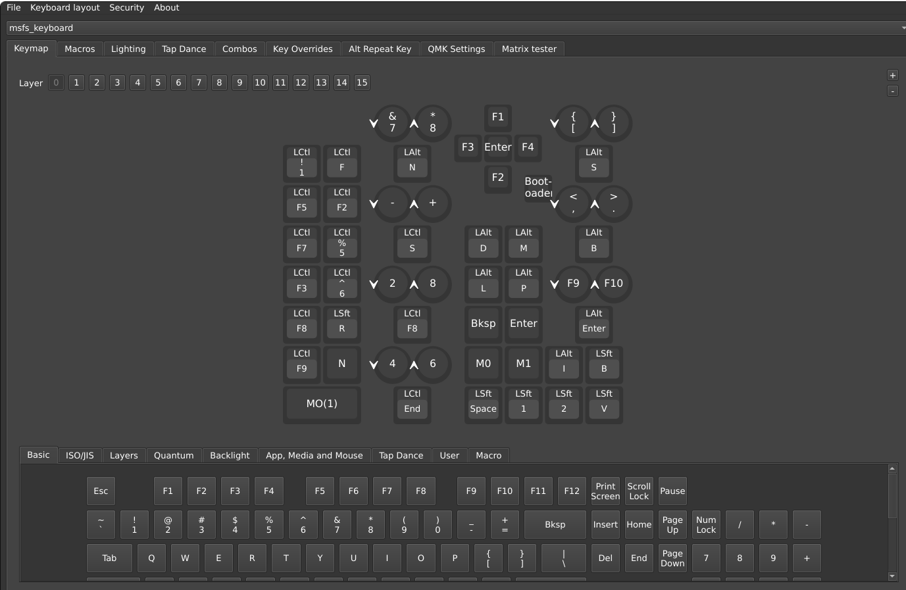

# MSFS Macro Keyboard for PS5

PS5版 Microsoft Flight Simulator 2024 (MSFS2024) に最適化した、27キー、7ロータリーエンコーダー搭載の自作マクロキーボードです。

## 特徴
* **PS5完全対応**: PS5版 MSFS2024 での動作を確認済み。
* **Vial対応**: 専用ソフトのインストール不要。ブラウザ上で簡単にキーアサインを変更できます。
* **膨大なレイヤー数**: 最大16レイヤーに対応し、機体ごとの複雑な操作も割り当て可能。
* **高度なマクロ**: 複雑なキーシーケンスをワンタップで実行。
* **LEDインジケーター**:
    * **SIM Rate確認**: 4番目のLEDの色で、現在のSIM Rateを視覚的に判別可能（ユーザーキーコード制御）。
    * **レイヤー確認**: 5番目のLEDの色で、現在選択中のレイヤーを一目で把握。

## 外観

## 基板の入手方法
本プロジェクトの専用プリント基板（PCB）は、メルカリにて頒布しています。
「**#MSFS2024自作キーボード**」で検索してください。
[メルカリで探す](https://jp.mercari.com/search?keyword=%23MSFS2024%E8%87%AA%E4%BD%9C%E3%82%AD%E3%83%BC%E3%83%9C%E3%83%BC%E3%83%89)

※基板とケースがセットになったものも、メルカリにて頒布を予定しています。

## 本キーボードの紹介 youtube
組み立ての様子、ファームウェアの書き込み、動作確認、MSFS2024 PS5版でのデモンストレーションをYouTubeで公開しています。
[youtubeで開く](https://youtu.be/_a79jdPi4Ig)

## 回路図
[回路図(PDF)](msfs_keyboard_schematic.pdf)

## 必要部材 (BOM)

| リファレンス名 | 部品 | 数量 | 型式など | 主な入手先 |
| :--- | :--- | :---: | :--- | :--- |
| U1 | CPU基板 | 1 | RP2040マイコンボードキット | [秋月電子通商](https://akizukidenshi.com/catalog/g/g117542/) |
|　( SW1-19, SW21-28) | キースイッチ | 27 | cherry MX互換スイッチ | [遊舎工房でさがす](https://shop.yushakobo.jp/collections/cherry-mx-clone) |
| SW1-19, SW21-28 | キースイッチソケット | 27 | Kailh Switch Socket(MX用) | [遊舎工房](https://shop.yushakobo.jp/products/a01ps?variant=37665172521121) |
| RSW1-RSW7 | ロータリーエンコーダ | 7 | EC11 互換品 | [Amazon](https://www.amazon.co.jp/dp/B0C9QH83N6?ref=ppx_yo2ov_dt_b_fed_asin_title&th=1) |
| JSTICK1 | ジョイスティック | 1 | RKJXV122400R(アルプスアルパイン) | [秋月電子通商](https://akizukidenshi.com/catalog/g/g115951/) |
| SW20 | リセットスイッチ | 1 | TVD01-G73BB | [秋月電子通商](https://akizukidenshi.com/catalog/g/g109824/) |
| D1-D36 | ダイオード(SMD) | 36 | 1N4148W 互換 | [遊舎工房](https://shop.yushakobo.jp/products/a0800di-02-100) |
| LED1-LED5 | フルカラーLED | 5 | WS2812B 互換 | [遊舎工房](https://shop.yushakobo.jp/products/a0800ws-01-10) |
| C1-C5 | セラミックコンデンサ 0.1uF | 5 | 1608サイズ (省略可) | [秋月電子通商](https://akizukidenshi.com/catalog/g/g113374/) |
| - | インサートナット | 15 | M2 雌ねじ用(直径3mm×高さ3mm) | [Amazon](https://www.amazon.co.jp/dp/B0CTTLJL6S?ref=ppx_pop_dt_b_product_details&th=1) |
| - | パネル固定ねじ | 13 | M2ねじ 10mm | ホームセンター等 |
| - | CPUカバー取り付けねじ | 2 | M2ねじ 5mm | ホームセンター等 |
| - | アナログスティック交換用 | 1 | PS4コントローラ用 等 | [Amazon](https://www.amazon.co.jp/dp/B0C7C78LKB?ref=ppx_yo2ov_dt_b_fed_asin_title) |

## 筐体の入手方法
`3Dmodel_STL` フォルダにケース本体、トップパネル、ジョイスティックカバー、CPUカバーのSTLファイルを格納しています。 
3Dプリンターを用い、一般的なPLA素材での印刷が可能です。 
※基板とケースがセットになったものも、メルカリにて頒布を予定しています。

## 組み立てに必要な道具
* **工具**: はんだごて、はんだ、ピンセット、ドライバー
* **あると便利なもの**: 虫めがね、テスター（導通確認用）
* **設定用**: PC、USBケーブル（ファームウェア書き込み・キーアサイン変更用）

## キーキャップの入手方法
市販のキーキャップのほか、3Dプリンターでの制作も可能です。

* **Keycap Generator**: [makerworldで開く](https://makerworld.com/en/models/1378891-keycap_generator#profileId-1426845)
  * このツールを利用して印刷したキーキャップのデータも `3Dmodel_STL` フォルダに同梱しています。(keycap_bambu.3mf)

## 設定方法
1. [Vial Web](https://get.vial.today/) にアクセスします。
2. キーボードを接続し、ブラウザ上でキーアサインやマクロを自由に編集してください。

## 開発環境
* Firmware: QMK / Vial
* MCU: RP2040
